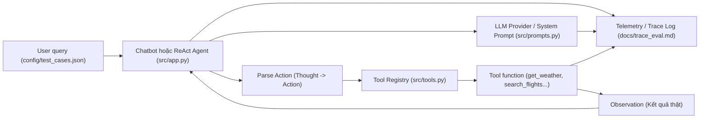
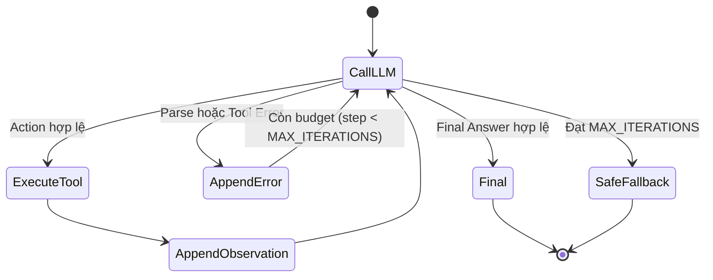

# Lab 03 — Chatbot vs ReAct Agent 

**AI Agent · Day 3 · ~240 phút****VinUni AI Codelab × GDGoC · Cập nhật 2026-07-27**

> **240 phút · Day 3 · intermediate.** Bạn sẽ xây một chatbot baseline, thiết kế tool contract, lắp [ReAct Agent](#glossary "Reasoning + Acting — kiến trúc agent luân phiên suy nghĩ (Thought), hành động (Action) và nhận kết quả (Observation) cho đến khi đủ bằng chứng trả lời.") và so sánh hai hệ thống trên cùng bộ test case thực tế tại phòng E402. Phần lớn bài chạy [deterministic](#glossary "Cùng input + cùng data luôn ra cùng output — không phụ thuộc model hay mạng.") — chưa cần API key phức tạp ngay từ đầu.

Câu hỏi trọng tâm xuyên suốt Lab:

> **Chatbot trả lời được — nhưng nó có thật sự "biết" không? Khi nào chi phí orchestration của Agent đáng giá?**

### 🧩 4 Cấp Độ Tiến Hóa Của AI Hội Thoại (From Rule-Based to Autonomous Agent)

| Cấp độ | Loại hệ thống | Cách hoạt động | Đánh giá & Ứng dụng trong Bài Lab |
| :---: | :--- | :--- | :--- |
| **Cấp 1** | **Rule-Based Bot** | Khớp từ khóa if/else cố định | Nhanh nhưng cứng nhắc, không có LLM (*Lịch sử*) |
| **Cấp 2** | **LLM Chatbot** | Dùng LLM sinh text mượt mà | Trả lời tự nhiên nhưng không có tool ➔ **Chatbot Baseline** |
| **Cấp 3** | **Reactive Agent** | Vòng lặp `Thought -> Action -> Observation` | Gọi tool thực tế, trích xuất dữ liệu ➔ **ReAct Agent (Trọng tâm)** |
| **Cấp 4** | **Autonomous Agent** | Tự chia nhỏ mục tiêu (Planning) + Bộ nhớ (Memory) | Giải quyết bài toán dài hạn ➔ 🎁 **Phần Bonus Nâng cao (+10%)** |

---

## 1. Setup và hiểu kiến trúc

:::goal{title="Repo chạy, kiến trúc rõ"}
Bạn có repo `Day-3-Lab-Chatbot-vs-react-agent-E402` trên máy, môi trường sẵn sàng, hiểu vai trò từng thành phần và phân vai nhóm 5-6 người.
:::

### Fork, clone, cài môi trường

Mở repo `Day-3-Lab-Chatbot-vs-react-agent-E402`, bấm **Fork** rồi clone về máy theo hướng dẫn.

Cài môi trường:

```bash
cd Day-3-Lab-Chatbot-vs-react-agent-E402
python -m venv .venv
source .venv/bin/activate        # Windows PowerShell: .venv\Scripts\Activate.ps1
python -m pip install --upgrade pip
python -m pip install -r requirements.txt
cp .env.example .env
```

Smoke test:

```bash
python src/app.py
```

### Kiến trúc — biết trước khi code

Mở [README.md](file:///c:/Users/Admin/Documents/VinUni/LabCoachVin/LabKeyCoach/Day-3-Lab-Chatbot-vs-react-agent-E402/README.md) và [docs/PHAN_CONG_CONG_VIEC.md](file:///c:/Users/Admin/Documents/VinUni/LabCoachVin/LabKeyCoach/Day-3-Lab-Chatbot-vs-react-agent-E402/docs/PHAN_CONG_CONG_VIEC.md). Đọc sơ đồ bên dưới — nhóm bạn sẽ xây từng phần:



| Thành phần               | Vai trò                                                             | File phụ trách                     |
| :------------------------- | :------------------------------------------------------------------- | :----------------------------------- |
| **Test Cases**       | Bộ đề câu hỏi từ đơn giản đến multi-step và bẫy         | `config/test_cases.json` (Role 1)  |
| **Tool Registry**    | Khai báo các món đồ nghề (Tools) cho AI gọi                   | `src/tools.py` (Role 2)            |
| **System Prompt**    | Ép AI suy luận dạng Thought ➔ Action & Guardrails                | `src/prompts.py` (Role 3)          |
| **Agent Integrator** | Điều phối vòng lặp ReAct (`Thought -> Action -> Observation`) | `src/app.py` (Role 4 - Integrator) |
| **Observability**    | Ghi log trace để debug và làm báo cáo so sánh                 | `docs/trace_eval.md` (Role 5)      |

:::checkpoint{title="Hoàn thành khi"}
[ ] Terminal hiển thị `(.venv)`, gõ `python src/app.py` chạy thành công không báo lỗi.
[ ] Bạn giải thích được vai trò Provider, Agent, Tool, Observation và Telemetry.
[ ] Cả nhóm đã thống nhất phân vai 5-6 thành viên theo file `docs/PHAN_CONG_CONG_VIEC.md`.
:::

:::caution{title="Troubleshooting — Vấn đề thường gặp"}
`python` không tìm thấy / sai phiên bản
→ **Mindset**: Tách "Python nào đang chạy?" khỏi "Code đúng chưa?" — xác minh interpreter trước.
→ Thử `python3 --version` (cần ≥ 3.10).

Lỗi Font / Encoding tiếng Việt trên Windows Terminal
→ Code trong `src/app.py` đã tự động reconfigure `sys.stdout` sang `utf-8`.

ModuleNotFoundError khi chạy `python src/app.py`
→ Kiểm tra đã activate `.venv` chưa và đứng ở thư mục gốc repo chưa.
:::

---

## 2. Chatbot baseline — thấy giới hạn, rồi xây đường cơ sở

:::goal{title="Hiểu giới hạn chatbot và có baseline công bằng"}
Nhận ra chatbot thuần không có grounding dữ liệu thời gian thực, rồi xây baseline một LLM call không dùng tool để làm đường cơ sở so sánh với Agent.
:::

### Hook — Chatbot biết gì thật?

Tưởng tượng hỏi Chatbot tư vấn đặt vé & thời tiết:

> *"Thời tiết ở Hà Nội hôm nay thế nào và tôi nên chọn chuyến bay nào đi Hà Nội ngày mai?"*

Tự trả lời: Giá vé đến từ đâu? Thời tiết có chuẩn hôm nay không? Một câu trả lời nghe hợp lý có đồng nghĩa là **grounded** (có bằng chứng thực tế) không?

| Thành phần                      |   Chatbot có trả lời?   | Có evidence thật từ Tool? | Có thực hiện Action? |
| :-------------------------------- | :-------------------------: | :--------------------------: | :---------------------: |
| **Thời tiết thực tế**   |  ❌ (Chỉ bịa/chém gió)  |              ❌              |           ❌           |
| **Giá vé máy bay thực** | ❌ (Chỉ đưa con số ảo) |              ❌              |           ❌           |
| **Tư vấn chung**          |             ✅             |              ❌              |           ❌           |

→ Chatbot có thể bịa một câu trả lời nghe rất mượt nhưng không có evidence từ database/tool. Đây là lý do ta cần ReAct Agent + Tools.

### Xây baseline trong `src/prompts.py` & `src/app.py`

Baseline protocol:

```text
system prompt + user message → một LLM call → final response (không gọi Tool)
```

Baseline **KHÔNG** được: gọi tool, nhúng sẵn kết quả tool vào prompt, hoặc khẳng định action đã hoàn tất.

**Bạn làm**:

1. **Role 3**: Mở `src/prompts.py` — soạn `CHATBOT_BASELINE_PROMPT`.
2. **Role 4**: Mở `src/app.py` — chạy hàm `run_baseline_chatbot()` trên 5 câu test trong `config/test_cases.json`.
3. **Role 5**: Lưu phản hồi vào `docs/trace_eval.md` và phân loại output: *correct*, *safe fallback* hay *hallucinated*.

:::caution{title="Đừng vội kết luận Agent luôn thắng"}
Câu hỏi của bài Lab: Khi nào chi phí orchestration của Agent đáng giá? Với câu hỏi Q&A lý thuyết đơn giản, Chatbot thuần vẫn nhanh và rẻ hơn Agent!
:::

:::checkpoint{title="Hoàn thành khi"}
[ ] Chatbot dùng đúng 1 LLM call, số lần gọi tool = 0.
[ ] Raw answer đã được Role 5 lưu vào `docs/trace_eval.md` và phân loại output từng case.
:::

:::caution{title="Troubleshooting — Vấn đề thường gặp"}
"Chatbot trả lời có vẻ đúng — nó đã có tool rồi à?"
→ **Mindset**: Đừng tin output mượt mà — hãy kiểm tra code path. Nếu `tool_calls = 0`, đó chỉ là hallucination (ảo giác của LLM), không phải bằng chứng thực tế.
:::

---

## 3. Thiết kế và test tool

:::goal{title="Tool chạy đúng, test pass — trước khi gắn Agent"}
Viết các tool deterministic trong src/tools.py, có contract rõ ràng và xử lý error an toàn.
:::

### Tại sao test tool riêng trước?

Nếu gắn tool chưa test vào Agent rồi Agent chạy sai ➔ Bạn không biết lỗi nằm ở Tool hay nằm ở Agent. Test riêng tool trước giúp loại bỏ hoàn toàn một nguồn lỗi!

### Tool contract — 8 câu hỏi chuẩn

| Field                     | Câu hỏi chuẩn hóa                                                               |
| :------------------------ | :---------------------------------------------------------------------------------- |
| **Name**            | Tên duy nhất, rõ nghĩa? (Ví dụ:`get_weather`, `search_flights`)           |
| **Purpose**         | Khi nào nên dùng, khi nào không?                                               |
| **Input schema**    | Field nào required, type gì? (`location: str`, `origin: str`)                 |
| **Output schema**   | Trả về gì khi thành công? (Chuỗi JSON hoặc string rõ thông số)            |
| **Error semantics** | Khi nhập sai địa điểm thì trả về gì? (Trả chuỗi báo lỗi, không crash) |
| **Side effect**     | Read-only tra cứu hay thay đổi trạng thái?                                     |
| **Example**         | Input / Output hợp lệ mẫu?                                                       |
| **Safety**          | Có bắt lỗi crash exception không?                                               |

### Bạn làm (Role 2 - Tool Engineer):

1. Mở file `src/tools.py` — implement các hàm tool (Ví dụ: `get_weather`, `search_flights` hoặc các tool theo chủ đề tự chọn).
2. Thêm **Docstring / Schema** đầy đủ cho từng hàm.
3. Bắt lỗi an toàn: Nếu địa điểm không tồn tại ➔ Trả về `"LỖI: Không tìm thấy thông tin..."` thay vì quăng lỗi crash chương trình.

```python
# Mẫu tool chuẩn trong src/tools.py
def get_weather(location: str) -> str:
    """Tra cứu thời tiết hiện tại của một thành phố."""
    loc_lower = location.lower()
    if "hà nội" in loc_lower:
        return "Thời tiết Hà Nội: 28°C, Nắng nhẹ, Độ ẩm 65%."
    return f"LỖI: Không tìm thấy dữ liệu thời tiết cho địa điểm '{location}'."
```

:::checkpoint{title="Hoàn thành khi"}
[ ] Các tool trong `src/tools.py` chạy thử độc lập pass 100%, không crash khi nhập sai tham số.
[ ] Mỗi tool có docstring mô tả input/output/error contract rõ ràng.
[ ] Đã đăng ký danh sách tool vào dictionary `AVAILABLE_TOOLS`.
:::

:::caution{title="Troubleshooting — Vấn đề thường gặp"}
"Tool quăng ngoại lệ Exception làm dừng chương trình"
→ **Mindset**: Error nghiệp vụ là dữ liệu cho Agent suy luận. Trả về chuỗi thông báo lỗi dạng JSON/String để Agent đọc và chuyển hướng, không cho code Python bị crash.
:::

---

## 4. Lắp ReAct Agent V1

:::goal{title="Agent V1 chạy đúng tool path, dừng đúng lúc"}
Hiểu vòng lặp ReAct, lắp system prompt ➔ parser ➔ executor ➔ loop. Agent gọi đúng tool, append Observation, và dừng đúng phanh Guardrails.
:::

### Chuỗi Trace mẫu ReAct (`Thought -> Action -> Observation`)

```text
Question: Thời tiết Hà Nội hôm nay thế nào và có chuyến bay nào đi Hà Nội ngày mai không?

Thought: Cần kiểm tra thời tiết Hà Nội trước.
Action: get_weather["Hà Nội"]
Observation: Thời tiết Hà Nội: 28°C, Nắng nhẹ, Độ ẩm 65%.

Thought: Tiếp theo cần tra cứu chuyến bay đi Hà Nội ngày mai.
Action: search_flights["TP.HCM", "Hà Nội"]
Observation: Chuyến bay VN123 (08:00) - Giá: 1,500,000 VNĐ.

Thought: Tôi đã có đủ thông tin về thời tiết và chuyến bay.
Final Answer: Thời tiết Hà Nội hôm nay 28°C nắng nhẹ. Chuyến bay VN123 khởi hành lúc 08:00 với giá 1,500,000 VNĐ.
```

### State Machine của ReAct Agent Loop



### 4 Nguyên tắc bất biến khi code ReAct Loop:

1. **Không lặp vô hạn**: Bắt buộc có phanh `MAX_ITERATIONS`.
2. **Mỗi Action ➔ Đúng 1 Observation**: Application chèn kết quả thật từ Tool, LLM không tự bịa Observation.
3. **Observation quay lại Prompt**: Làm ngữ cảnh cho bước suy luận `Thought` tiếp theo.
4. **Không khẳng định khi thiếu bằng chứng**: Phải gọi Tool lấy data rồi mới ra `Final Answer`.

### Bạn làm (Role 3 & Role 4):

1. **Role 3**: Soạn `REACT_SYSTEM_PROMPT` và cấu hình phanh Guardrails `MAX_ITERATIONS` trong `src/prompts.py`.
2. **Role 4 (Integrator)**: Thực hiện `git pull` kéo file của Role 1, 2, 3 về ➔ Vibe Code ghép nối vòng lặp `run_react_agent()` trong `src/app.py`.
3. **Role 5**: Chạy `python src/app.py` và dán chuỗi log trace vào `docs/trace_eval.md`.

:::checkpoint{title="Hoàn thành khi"}
[ ] Agent chạy qua đúng chuỗi `Thought -> Action -> Observation`.
[ ] Observation của bước trước xuất hiện trong prompt suy luận của bước sau.
[ ] Phanh Guardrail `MAX_ITERATIONS` hoạt động ngắt lặp an toàn khi gặp câu bẫy.
[ ] Đã lưu log trace vào `docs/trace_eval.md`.
:::

:::caution{title="Troubleshooting — Vấn đề thường gặp"}
Agent lặp đi lặp lại cùng một Tool + cùng tham số
→ **Mindset**: Agent không tự nhận ra mình bị kẹt lặp.
→ Kiểm tra: Đã đặt `MAX_ITERATIONS` chưa? Prompt có hướng dẫn nếu tool báo lỗi thì thử cách khác không?

Agent trả Final Answer quá sớm — trước khi gọi Tool
→ **Mindset**: Prompt chưa ép khung kỷ luật.
→ Thêm quy tắc vào `REACT_SYSTEM_PROMPT`: "Chỉ trả Final Answer khi đã có dữ liệu Observation từ Tool."
:::

---

## 5. Failed trace → Agent V2

:::goal{title="Sửa lỗi có bằng chứng, nâng cấp Agent V2"}
Phát hiện một failed trace (lỗi lặp vô hạn, gọi sai tên tool, nhập sai tham số), phân tích nguyên nhân gốc (Root Cause) và nâng cấp lên Agent V2.
:::

### Tạo lỗi có chủ đích & Phân tích RCA (Root Cause Analysis)

| Dạng lỗi (Failure Mode) | Biểu hiện thực tế                                      | Cách Agent V2 khắc phục                                                                                        |
| :------------------------ | :--------------------------------------------------------- | :---------------------------------------------------------------------------------------------------------------- |
| **Unknown Tool**    | AI gọi tool`search_product` không có trong danh sách | Trả về thông báo lỗi dạng:`Tool không tồn tại, các tool hợp lệ gồm: [get_weather, search_flights]` |
| **Malformed Args**  | AI truyền tham số sai cú pháp`get_weather['Hanoi'`   | Xử lý parser linh hoạt hoặc trả về gợi ý cú pháp đúng                                                 |
| **Repeated Action** | Gọi liên tục 1 tool với cùng tham số                 | Phanh an toàn ngắt khi chạm ngưỡng`MAX_ITERATIONS`                                                         |

### Bạn làm:

1. **Role 1 & Role 5**: Cố tình đặt 1 câu hỏi bẫy (Edge Case) trong `config/test_cases.json` để ép Agent bộc lộ lỗi.
2. **Role 3 & Role 4**: Nâng cấp System Prompt & Parser trong `src/prompts.py` và `src/app.py` thành phiên bản **Agent V2** có khả năng tự phục hồi (Recovery) và Safe Fallback.
3. **Role 5**: Ghi lại so sánh Before/After vào `docs/trace_eval.md`.

:::checkpoint{title="Hoàn thành khi"}
[ ] Có ít nhất 1 Failed Trace được phân tích nguyên nhân gốc trong `docs/trace_eval.md`.
[ ] Agent V2 không bị crash khi gặp câu bẫy, trả về câu thông báo lịch sự khi chạm giới hạn.
:::

---

## 6. Evaluation, report và nộp bài

:::goal{title="So sánh công bằng, nộp bài sạch sẽ lên GitHub"}
Chạy bộ Test Cases trên cả Chatbot Baseline và ReAct Agent, hoàn thiện báo cáo docs/trace_eval.md và push code sạch lên GitHub.
:::

### Bộ 5 Test Cases gợi ý (`config/test_cases.json`)

|      #      | Loại câu hỏi                   | Mục đích kiểm tra                     | Kỳ vọng ở Agent                                          |
| :---------: | :-------------------------------- | :---------------------------------------- | :---------------------------------------------------------- |
| **1** | 🟢 Đơn giản (Chỉ lý thuyết) | Hỏi đáp thông thường                | Trả lời ngay, Chatbot có thể nhanh hơn                 |
| **2** | 🟢 Đơn giản (Chỉ lý thuyết) | Hỏi đáp quy định/chính sách        | Trả lời ngay, không cần gọi tool                       |
| **3** | 🟡 Multi-step (Cần Tool)         | Đòi hỏi dữ liệu thời gian thực     | Gọi đúng 1 Tool ➔ Trả lời có bằng chứng            |
| **4** | 🟡 Multi-step (Cần 2 Tools)      | Phụ thuộc nhiều bước                 | Gọi Tool 1 ➔ Gọi Tool 2 ➔ Tổng hợp kết quả          |
| **5** | 🔴 Edge Case (Câu bẫy)          | Nhập sai địa điểm / tham số vô lý | Tool báo lỗi ➔ Agent ngắt lặp an toàn bằng Guardrail |

### Rubric đánh giá 0–2 điểm mỗi case

| Tiêu chí                    | 0 điểm                | 1 điểm                  | 2 điểm                              |
| :---------------------------- | :---------------------- | :------------------------ | :------------------------------------ |
| **Factual correctness** | Sai / Bịa đặt        | Đúng một phần         | Đúng hoàn toàn                    |
| **Grounding**           | Không có bằng chứng | Bằng chứng thiếu       | Trích dẫn Observation rõ ràng     |
| **Tool selection**      | Gọi sai / Không gọi  | Có tự sửa lỗi         | Gọi đúng thứ tự tool path        |
| **Termination**         | Lặp vô hạn / Crash   | Dừng nhưng thừa bước | Dừng đúng lúc (Final / Guardrail) |

### Kiểm tra Bảo mật & Nộp bài (Security Check & Submission)

1. **Kiểm tra `.gitignore`**: Đảm bảo `.env`, `__pycache__/` không bị đẩy lên Git.
2. **Đẩy code lên GitHub**:
   ```bash
   git add .
   git commit -m "Hoan thanh Lab 03: Chatbot vs ReAct Agent E402"
   git push origin main
   ```
3. **Nộp link Repository**: Gửi link repo GitHub cho Giảng viên/Coach kiểm tra.

---

### 📋 CHECKLIST ARTIFACTS BẮT BUỘC KHI NỘP BÀI

- [X] 📘 [README.md](file:///c:/Users/Admin/Documents/VinUni/LabCoachVin/LabKeyCoach/Day-3-Lab-Chatbot-vs-react-agent-E402/README.md) — Tổng quan kiến trúc & Rubric chấm điểm.
- [X] 📋 [docs/PHAN_CONG_CONG_VIEC.md](file:///c:/Users/Admin/Documents/VinUni/LabCoachVin/LabKeyCoach/Day-3-Lab-Chatbot-vs-react-agent-E402/docs/PHAN_CONG_CONG_VIEC.md) — Sổ tay phân công 5 Roles & Checklist theo mốc.
- [X] 💡 [docs/DANH_SACH_DE_TAI.md](file:///c:/Users/Admin/Documents/VinUni/LabCoachVin/LabKeyCoach/Day-3-Lab-Chatbot-vs-react-agent-E402/docs/DANH_SACH_DE_TAI.md) — Danh sách 10 chủ đề gợi ý.
- [X] 📊 [docs/trace_eval.md](file:///c:/Users/Admin/Documents/VinUni/LabCoachVin/LabKeyCoach/Day-3-Lab-Chatbot-vs-react-agent-E402/docs/trace_eval.md) — Báo cáo Log Trace & Bảng đánh giá Scoring Matrix.
- [X] 🟢 [config/test_cases.json](file:///c:/Users/Admin/Documents/VinUni/LabCoachVin/LabKeyCoach/Day-3-Lab-Chatbot-vs-react-agent-E402/config/test_cases.json) — Bộ đề Test Cases.
- [X] 🛠️ [src/tools.py](file:///c:/Users/Admin/Documents/VinUni/LabCoachVin/LabKeyCoach/Day-3-Lab-Chatbot-vs-react-agent-E402/src/tools.py) — Khai báo các công cụ (Role 2).
- [X] 🧠 [src/prompts.py](file:///c:/Users/Admin/Documents/VinUni/LabCoachVin/LabKeyCoach/Day-3-Lab-Chatbot-vs-react-agent-E402/src/prompts.py) — System Prompt ReAct & Guardrails (Role 3).
- [X] 🚀 [src/app.py](file:///c:/Users/Admin/Documents/VinUni/LabCoachVin/LabKeyCoach/Day-3-Lab-Chatbot-vs-react-agent-E402/src/app.py) — Core App ghép nối vòng lặp ReAct (Role 4).

---

> 🎯 **Thông điệp cuối cùng**: Đừng chỉ đánh giá Agent bằng câu trả lời cuối cùng. Hãy đánh giá toàn bộ hành trình — từ Tool contract, Action, Observation, cơ chế tự phục hồi lỗi, phanh an toàn Guardrail đến nhật ký Trace Log định lượng!
